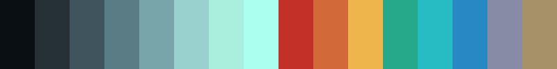
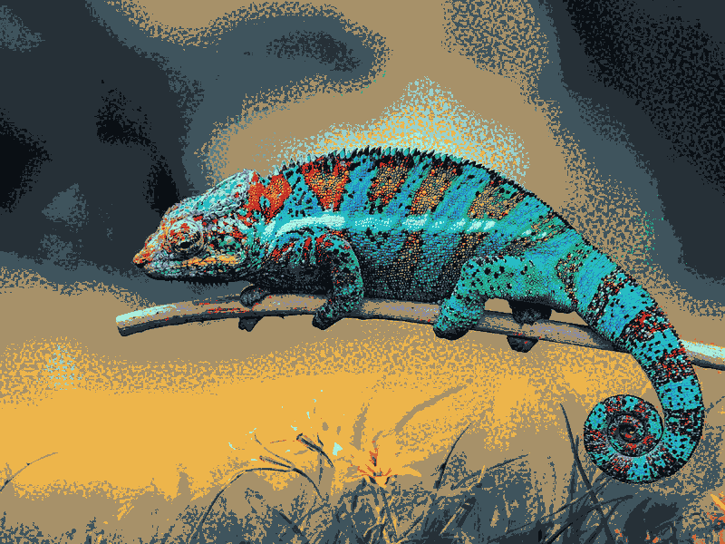

# base16-chameleon-scheme

chameleon is a "somewhat opinionated" colorscheme. It wants to look bold and
interesting while still being usable for a typical terminal workload.

## Design

Any colorscheme I use needs to fit my cardinal virtues for a colorscheme, in
rough order of importance:

1. The scheme must be *legible* 
   - All the colors must stand out against the default foreground. In current
     year, this is how we write terminal programs. Basically, is default vim's
     or vanilla [gomacs][gomacs]' syntax highlighting legible?
   - At the same time, as a nice-to-have, are the colors legible against each
     other? It's somewhat rare but not unheard of that a program will still be
     using blue as a background color, in which case the blue color is left in
     the tricky spot of trying to be both a background or a foreground color.
     Very few schemes deal with this gracefully!

2. The scheme must be *distinct*
   - It must be obvious at a glance what color is being used for something.
   - All the colors must be distinguishable from each other. The most common
     offender here is cyan, blue, and occasionally green or even the background
     muddling together like the awful Solarized Dark.
   - This obviously ties into the last virtue, but it's possible to be legible
     yet indistinct. Plenty of the stock base16 schemes look lovely, but two of
     the colors are inexplicably the same or so similar that it's hard to tell
     them apart.

3. The scheme must be *unique* - it has to be interesting and have its own
   "character". This is a subjective quality, but here's some things I like:
   - Bold, bright colors - Snazzy does this well.
   - Unusual foreground/background colors. Use off-white text on off-black 
     background. Heck, I used a brownish theme for a while! Anything that makes
     you say "wow!" is in with a chance.
   - Something that works within the limitations of the 16 colors imposed on us
     by the tyranny of the VGA legacy without fully submitting to it either.
     Purple instead of magenta is a good one. Ignoring the regular/bright
     distinction works well for base16 and is generally the way I go these days.
   - This is another problem with Solarized Dark - everything just looks like
     blue-green gunge. Unusual, I suppose, but not aesthetically pleasing.

chameleon hopefully succeeds at all 3 by design. Each color was chosen to first
be legible, second be distinct, and third be unique and aesthetically pleasing.
There's some useful side effects; blue as a background doesn't looks *great* but
it is at least legible enough to go through a menu and change to a theme that
doesn't suck.

[gomacs]: https://github.com/japanoise/gomacs

## The colors

(PSST: This looks awesome with [rainbow-mode][rainbow] enabled!)

Here's each of the colors, a color name generated by
[coolors](https://coolors.co/), what base16 says this color will be used for,
and some thoughts on each color.

* base00 - #0a0f14 - Rich Black - "Default Background" - This is a color from
  the original author. I love off-black. This one has a very very subtle navy
  tint.
* base01 - #263037 - Gunmetal - "Lighter Background" - I generated 01-04 using a
  gradient generator.
* base02 - #3f545d - Charcoal - "Selection Background"
* base03 - #5a7c84 - Slate Gray - "Comments, Invisibles, Line Highlighting"
* base04 - #77a5aa - Moonstone - "Dark Foreground"
* base05 - #98d1ce - Tiffany Blue - "Default Foreground, Caret, Delimiters,
  Operators" - This is the stand-out color from the original theme. It's an
  ambiguous turquoise which gives a quality somehow both cold (like a blue) yet
  welcoming and relaxing (like a green). It's eyecatching while still being a
  readable color for a screen full of text.
* base06 - #aaeedd - Tiffany Blue - "Light Foreground" - I came up with these by
  following the gradient relatively programatically to create a color that
  follows the gradient up and is brighter while still looking like it's in the
  same spectrum. Honestly, these colors are unlikely to be seen by many people
  outside of looking at the definitions, but they're nice enough to be usable in
  the rare program that will need them.
* base07 - #aaffee - Celeste - "Light Background" - Heh, love that name.
* base08 - #c33027 - Fire Engine Red - "Variables, XML Tags, Markup Link Text,
  Markup Lists, Diff Deleted" - This is a really nice red. It's bold and
  striking without being too bright and hard to read. Amazing the R value is as
  low as c3 while it still being a very "red" red.
* base09 - #d26939 - Flame - "Integers, Boolean, Constants, XML Attributes,
  Markup Link Url" - The original theme author gifted us with this gorgeous
  orange, and it's a shame it will most likely not turn up all that often. Some
  oranges (I notably think of the one from old versions of MS Paint) have a
  sickly color that reminds me of nothing more than a shriveled-up old carrot at
  the back of the fridge; this one is much better.
* base0A - #edb54b - Hunyadi yellow - "Classes, Markup Bold, Search Text
  Background" - A yellow that actually looks yellow rather than green or
  orange. Well, ok, it looks a little orange, but I'm cool with that. Yellow is
  usually one of the colors that can run into illegibility, so this one is
  another nice gift from the original author.
* base0B - #26a98b - Zomp - "Strings, Inherited Class, Markup Code, Diff
  Inserted" - What a great name. [Even has a kym page][zomp]. It's also a really
  nice shade of green. It's a good midpoint between the soothing forest greens and
  the striking pure greens. This was the primary color of my dwm setup.
* base0C - #27bcc4 - Robin egg blue - "Support, Regular Expressions, Escape
  Characters, Markup Quotes" - This is a tetradic color based on the red. To
  distinguish it from the blue, it tends much closer to green while also not
  being actually green.
* base0D - #2788C4 - Blue (NCS) - "Functions, Methods, Attribute IDs,
  Headings" - Another tetradic color. A vivid, readable blue, similar to
  Snazzy's.
* base0E - #888ba5 - Cool Gray - "Keywords, Storage, Selector, Markup Italic,
  Diff Changed" - A lavender color which is my least favorite of this batch. I
  just didn't like how a purple or straight magenta looked like, so I went with
  this shade from the original theme. May well change it later to a magenta or
  pink; but honestly this color's not used all that much and it looks fine.
* base0F - #a79169 - Lion - "Deprecated, Opening/Closing Embedded Language Tags,
  e.g. `<?php ?>`" - Another color from the original theme. Just a visually
  distinct color for the rare case this one is used.

[zomp]: https://knowyourmeme.com/memes/zomp
[rainbow]: https://elpa.gnu.org/packages/rainbow-mode.html

## History

Once upon a time, this was a vim theme called *Gotham* which I originally found
in [terminal.sexy](https://terminal.sexy/), created by Andrea 'whatyouhide'
Leopardi - [check it out here](https://github.com/whatyouhide/vim-gotham). At a
glance this theme already looks great - I particularly love the murky,
ambiguously blue-green foreground - but I'm not a fan of the illegible blue
shades for the bright colors. This theme is not usable as-is but it's a really
nice start!

I tweaked this colorscheme to my liking, rechristened it "gotham-chameleon", and
used it for many years as my theme everywhere - the legacy is still visible in
places like [my old .xresources][xr].

However, I had a lot of trouble with the bright colors; I could never find
something that was the right combination of legible and attractive. I eventually
saw [a really nice looking screenshot][snazzy] of the "Snazzy" theme in the 
prompt-pure repository. I was drawn in by the bright, readable colors (it didn't
help my theme's case that this prompt didn't look great in it) and switched to
Snazzy everywhere. I still use it via its base16 version.

However, I never forgot my first love. Every now and again I'd find an old
screenshot or a program I forgot to reconfigure, and it'd take me back. Then,
recently, I was working on [acme2k][acme], looking for colorschemes to try, and
I chanced across this old theme of mine. So, I decided I wanted to try bringing
it back.

With Emacs in rainbow-mode, I created a new base16 theme and copied over my old
.xresources; I cleaned up a few of the colors until I liked how it looked; and
here you have it.

I've called it "chameleon" rather than "Gotham" because I don't feel right
claiming the name someone else came up with for something that is no longer
their work. Hopefully writing this little spiel about it shows enough love to
the original creator that they won't get mad in the unlikely event they find
this repository. Besides, it's got a bunch of 'me' in it, and what better way to
retire my old handle than to use it to name something new?

[xr]: https://github.com/japanoise/scripts-dotfiles/blob/master/.Xresources
[snazzy]: https://github.com/sindresorhus/pure/blob/main/screenshot.png
[acme]: https://github.com/japanoise/acme2k

## Legal

Licensed MIT.

Chameleon.png is from
[Pixabay](https://pixabay.com/photos/chameleon-animal-wildlife-reptile-6159370/)
by user ELG21, cropped to 800x600 and dithered to the palette like so:

    convert chameleon.jpg -remap spectrum.png -dither Riemersma chameleon.png
